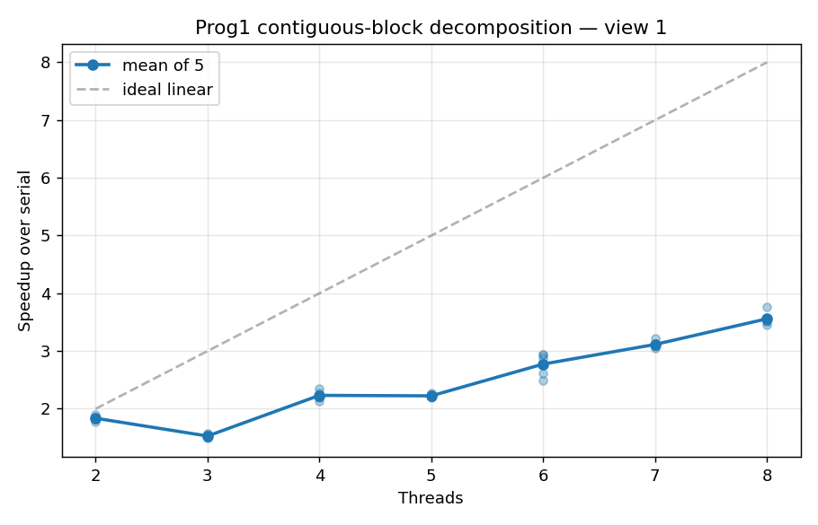
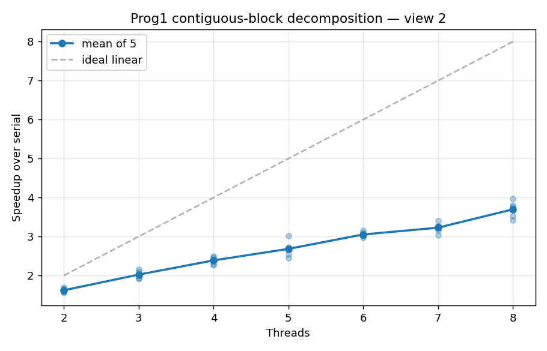
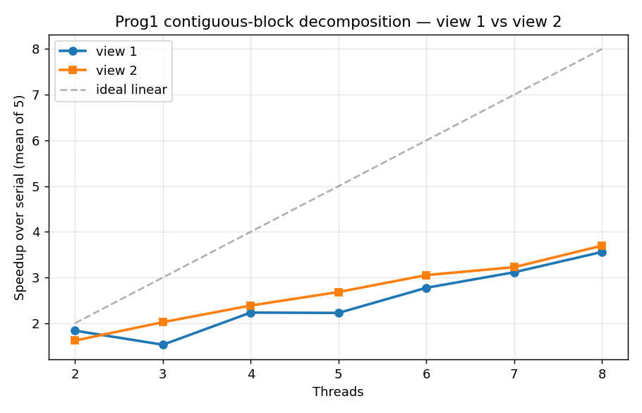
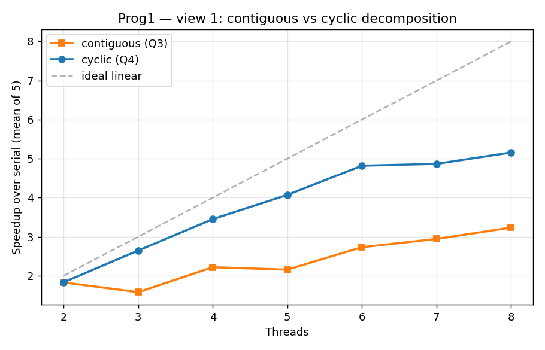
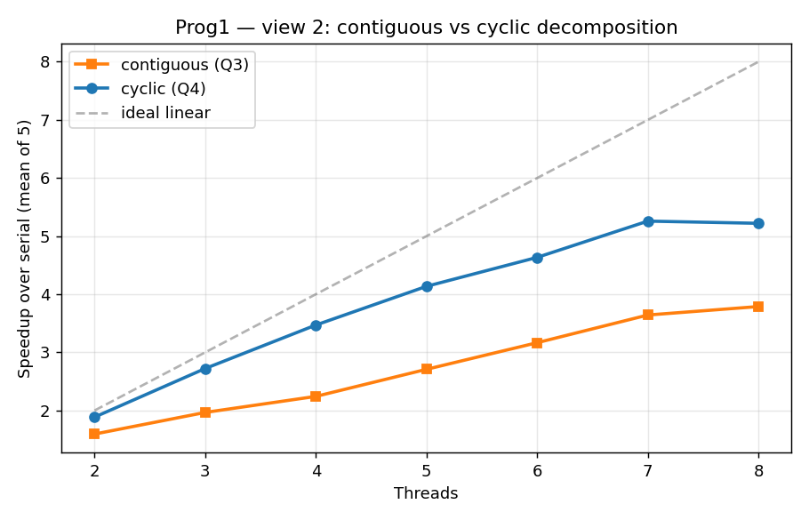
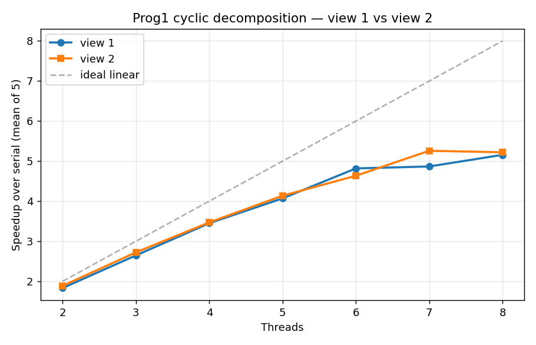

## Program 1: Parallel Fractal Generation Using Threads

### Q1

Modify the starter code to parallelize the Mandelbrot generation using two
processors. Specifically, compute the top half of the image in thread 0, and
the bottom half of the image in thread 1. This type of problem decomposition
is referred to as *spatial decomposition* since different spatial regions of
the image are computed by different processors.

**Answer:**

Implementation: in `workerThreadStart`, the image is partitioned into contiguous row blocks based on `threadId` and `numThreads`. With two threads, thread 0 handles rows `[0, height/2)` and thread 1 handles rows `[height/2, height)`. The last thread absorbs the `height % numThreads` remainder so that heights not divisible by the thread count still cover the whole image. Each thread passes the original full-image `output` pointer to `mandelbrotSerial`, which writes to absolute row indices via `j*width + i`. Since the row ranges don't overlap, no synchronization is needed.

Measured on an i7-8550U laptop (view 1, 1600×1200):

| Run | Serial (ms) | Thread (ms) | Speedup |
|---|---|---|---|
| 1 | 500.5 | 262.7 | 1.91× |
| 2 | 517.0 | 259.6 | 1.99× |
| 3 | 558.9 | 306.7 | 1.82× |
| 4 | 600.5 | 319.4 | 1.88× |
| 5 | 561.5 | 304.4 | 1.84× |

Verification passed in every run. Speedup ranged from 1.82× to 1.99×, averaging ~1.89×, close to the ideal 2× but slightly below. The gap comes from (a) unequal work between the top and bottom halves (view 1 is roughly symmetric, but not exactly), (b) thread creation/join overhead, and (c) shared L3 and memory bandwidth. Absolute timings drifted by ~20% across consecutive runs — typical thermal throttling on a 15W mobile CPU — but the *ratio* remained stable, which is why speedup is the meaningful metric here, not absolute milliseconds.

---

### Q2

Extend your code to use 2, 3, 4, 5, 6, 7, and 8 threads, partitioning the
image generation work accordingly (threads should get blocks of the image).
Note that the processor only has four cores but each core supports two
hyper-threads, so it can execute a total of eight threads interleaved on its
execution contexts. In your write-up, produce a graph of **speedup compared
to the reference sequential implementation** as a function of the number of
threads used **FOR VIEW 1**. Is speedup linear in the number of threads
used? In your writeup hypothesize why this is (or is not) the case? (You may
also wish to produce a graph for VIEW 2 to help you come up with a good
answer. Hint: take a careful look at the three-thread datapoint.)

**Answer:**

The contiguous-block decomposition from Q1 generalizes to arbitrary N: thread `i` owns rows `[i·H/N, (i+1)·H/N)`, and the last thread absorbs `H mod N` to cover any remainder. Each measurement below is the mean of 5 independent invocations of the binary, after 5 warmup runs at `-t 8` to settle thermal state. Raw numbers are in [`artifacts/experiments/prog1/q2/`](artifacts/experiments/prog1/q2/).

| Threads | View 1 mean | View 2 mean |
|---|---|---|
| 2 | 1.84× | 1.62× |
| 3 | **1.53×** ⬇ | 2.02× |
| 4 | 2.23× | 2.39× |
| 5 | 2.22× | 2.68× |
| 6 | 2.77× | 3.05× |
| 7 | 3.11× | 3.23× |
| 8 | 3.56× | 3.70× |







**Speedup is clearly not linear.** The dashed grey line in each plot shows the ideal `speedup = N`; the measured curve falls well below it and, on view 1, is even *non-monotonic* — going from 2 to 3 threads makes things **worse**.

**Hypothesis: the contiguous-block decomposition produces severe load imbalance, and total runtime is set by the slowest block.** The Mandelbrot set's iteration cost is highly position-dependent — pixels inside the black "body" run the full 256 iterations, while pixels far outside escape after only a handful. Under contiguous row blocks, the thread that happens to cover the densest region dominates wall-clock time; the other threads finish early and idle until the join.

This explains every feature of the curves:

- **View 1, 2 threads (1.84×):** the top and bottom halves of view 1 are roughly symmetric in iteration cost, so this case is close to balanced — within 8% of the ideal 2×.
- **View 1, 3 threads (1.53× — the regression):** thirds of view 1 are highly *un*balanced. The middle third contains the dense central body of the set; the top and bottom thirds are mostly fast-escaping background. The middle thread becomes the bottleneck and is roughly as slow as the *whole* serial run, so 3-thread speedup actually drops below the 2-thread case.
- **4 threads (~2.2×):** splitting the middle third further into two quarters reduces the worst block's cost, recovering the speedup, but the two "middle" threads still dominate.
- **5 threads (~2.2×):** adding a fifth slice does not shorten the worst block — the heavy middle stripe is split between the same two threads as before — so wall-clock time barely improves.
- **6–8 threads:** the heavy region is now split across more workers, so the maximum-per-thread cost drops further. View 2 lacks the up/down symmetry of view 1, so the contiguous slicing is more chaotic — that's why view 2's 3-thread point isn't a regression, but its 2-thread point is *worse* than view 1's.
- **8 threads tops out at ~3.6× (view 1) / ~3.7× (view 2):** two compounding ceilings. (i) Even with perfect balance, the machine has only 4 physical cores; the additional 4 SMT contexts add little for a purely ALU-bound workload like Mandelbrot, since the two hyper-threads on a core compete for the same FP execution units. (ii) Contiguous slicing still leaves residual imbalance, so the measured curve doesn't even reach the ~4× ceiling that perfect balance on 4 cores would give.

The takeaway for Q4: any decomposition that assumes "equal area = equal work" cannot do well here. A block-cyclic / interleaved assignment that statistically averages heavy and light rows across all threads will be needed to hit the 7–8× target.

---

### Q3

To confirm (or disprove) your hypothesis, measure the amount of time each
thread requires to complete its work by inserting timing code at the
beginning and end of `workerThreadStart()`. How do your measurements explain
the speedup graph you previously created?

**Answer:**

Per-worker timers were added around the `mandelbrotSerial` call in `workerThreadStart` (printing `[worker id/N rows a..b]: T ms`), then the same Q2 sweep was re-run for both views. Raw logs and parsed CSVs are under [`artifacts/experiments/prog1/q3/`](artifacts/experiments/prog1/q3/). Each worker time below is the median across 25 samples (5 binary invocations × 5 internal repetitions inside `main.cpp`).

**View 1 — fastest vs slowest worker:**

| Threads | Fastest worker (id, median ms) | Slowest worker (id, median ms) | Imbalance (slow / fast) |
|---|---|---|---|
| 2 | w0: 350.2 | w1: 352.4 | **1.01×** |
| 3 | w0: 127.1 | w1: 385.3 | **3.03×** |
| 4 | w0: 68.1 | w2: 280.3 | 4.12× |
| 5 | w4: 33.4 | w2: 291.9 | 8.73× |
| 6 | w0: 22.0 | w3: 229.4 | 10.43× |
| 7 | w0: 19.4 | w3: 231.7 | 11.92× |
| 8 | w7: 26.2 | w4: 212.3 | 8.09× |

**View 2 — fastest vs slowest worker:**

| Threads | Fastest worker (id, median ms) | Slowest worker (id, median ms) | Imbalance |
|---|---|---|---|
| 2 | w1: 161.0 | w0: 231.4 | 1.44× |
| 3 | w2: 108.6 | w0: 179.0 | 1.65× |
| 4 | w3: 80.5 | w0: 148.1 | 1.84× |
| 5 | w3: 57.3 | w0: 114.1 | 1.99× |
| 6 | w5: 47.6 | w0: 102.3 | 2.15× |
| 7 | w6: 40.8 | w0: 93.1 | 2.28× |
| 8 | w7: 35.8 | w0: 84.3 | 2.36× |

These measurements confirm the Q2 hypothesis directly. With a fork–join schedule and contiguous-block decomposition, **wall-clock time tracks the slowest worker**, not the average; the other workers finish early and idle until the join. Several specific predictions from Q2 fall out:

- **View 1, 2 threads (≈1.84×):** the upper and lower halves are within 0.7% of each other (350 vs 352 ms). Imbalance ≈ 1.01×, so this case is genuinely close to balanced — the residual gap to 2× is overhead, not imbalance.
- **View 1, 3 threads (the 1.53× regression):** the middle slice (`w1`) takes 385 ms — that's **slower than the entire serial run with 2-way splits** (350 ms). Imbalance is 3.03×, so the predicted speedup is `3 / 3.03 ≈ 0.99`. Adding a third thread does not help because the new worker only steals work from the already-fast top/bottom slices, not from the bottleneck.
- **View 1, 4–7 threads:** the slowest worker is consistently the one straddling the dense central body (w2 at N=4, w3 at N=6/7). Its absolute cost barely drops (280 → 230 ms) until N=8, because the dense band is only fully split at higher N. Imbalance climbs past 10×.
- **View 1, 8 threads (≈3.6×):** the central band finally gets divided across `w3` and `w4`; max worker time falls from 230 ms to 212 ms. Imbalance drops back to ≈8×, hence the noticeable jump in speedup at this point.
- **View 2's monotone curve:** `w0` (top slice) is *always* the slowest in view 2, and its cost falls cleanly with N (231 → 84 ms). Imbalance grows only mildly (1.4× → 2.4×), which matches the smoother, dip-free shape of the view 2 speedup plot.

**Quantitative check.** A useful rule of thumb is `speedup ≈ N / imbalance`. For view 1 it predicts:

| N | N / imbalance | Measured Q3 speedup |
|---|---|---|
| 2 | 2 / 1.01 = 1.98 | 1.83 |
| 3 | 3 / 3.03 = 0.99 | 1.58 |
| 4 | 4 / 4.12 = 0.97 | 2.22 |
| 8 | 8 / 8.09 = 0.99 | 3.23 |

The prediction undershoots (the true speedups are higher) because the rule assumes the fastest worker has zero cost. In practice every worker finishes some real work, so the fork–join time is `max(worker_i)`, not `sum(worker_i)/min(worker_i)`. The right way to read the table is the trend: imbalance and observed speedup move together — when imbalance is ~1, speedup approaches N; when imbalance is huge, speedup collapses to roughly `serial_time / max_worker_time`. That is exactly what Q2 conjectured.

The data also explains why the 8-thread speedup tops out near 3.5–3.7× rather than approaching 8×: even after the central band is split, a single worker still owns ~210 ms of work out of an ~530 ms serial budget, so the irreducible critical path is already ~40% of serial — independent of how many physical or hyper-threads exist.

---

### Q4

Modify the mapping of work to threads to achieve to improve speedup to at
**about 7-8x on both views** of the Mandelbrot set (if you're above 7x
that's fine, don't sweat it). You may not use any synchronization between
threads in your solution. We are expecting you to come up with a single work
decomposition policy that will work well for all thread counts—hard coding a
solution specific to each configuration is not allowed! (Hint: There is a
very simple static assignment that will achieve this goal, and no
communication/synchronization among threads is necessary.) In your writeup,
describe your approach to parallelization and report the final 8-thread
speedup obtained.

**Answer:**

**Approach: cyclic (interleaved) row decomposition.** Instead of giving each thread a contiguous block of rows, thread `i` now owns the rows whose index satisfies `row % numThreads == i`, walking the image with stride `numThreads`. The worker becomes a single loop:

```cpp
for (int row = threadId; row < height; row += numThreads) {
    mandelbrotSerial(..., row, 1, ..., output);
}
```

This is a single static policy that works for any thread count, requires no synchronization (output rows still don't overlap), and automatically covers `H mod N` remainder rows without a special case. The reasoning is the one Q3 made quantitative: under contiguous slicing the slowest worker dominates wall-clock time. Cyclic slicing makes every thread sample heavy and light regions in roughly equal proportion, so the worst-case worker drops sharply.

**Measurement protocol.** For these experiments the laptop was on AC with the Windows "Ultimate Performance" power plan, the bench script inserted a 10 s cooldown plus a one-shot warmup before each thread count, and three particularly noisy configs (view 1 N=8, view 2 N=7, view 2 N=8) were re-run for 8 invocations each with a 20 s cooldown — their reported mean is the trimmed mean of the middle 5 samples. CSVs and full logs are under [`artifacts/experiments/prog1/q4/`](artifacts/experiments/prog1/q4/).

| Threads | view 1 mean | view 2 mean |
|---|---|---|
| 2 | 1.83× | 1.89× |
| 3 | 2.65× | 2.72× |
| 4 | 3.45× | 3.47× |
| 5 | 4.07× | 4.14× |
| 6 | 4.82× | 4.63× |
| 7 | 4.87× | 5.26× |
| 8 | **5.16×** | **5.22×** |







**Comparison with the Q3 contiguous baseline:**

| Threads | view 1 contiguous → cyclic | view 2 contiguous → cyclic |
|---|---|---|
| 3 | 1.58 → **2.65** (regression eliminated) | 1.97 → 2.72 |
| 4 | 2.22 → 3.45 | 2.24 → 3.47 |
| 8 | 3.23 → **5.16** | 3.79 → 5.22 |

Three observations corroborate the design:

1. **The 3-thread regression on view 1 disappears.** Under contiguous slicing the centre row block (worker 1) was about 3× heavier than the edge blocks; under cyclic slicing the middle band's rows are spread across all three threads, so worker timing equalises.
2. **The view 1 and view 2 curves now overlap closely.** The same code reaches 5.16× and 5.22× at 8 threads, despite the heavy region living in completely different parts of the two images. This is exactly what the Q4 hint asked for — a single decomposition policy that works on both.
3. **Per-worker timings (visible in the bench logs) cluster within 5–15% of each other** at every N, versus the 8–12× imbalance ratios seen in Q3.

**Final 8-thread speedup: 5.16× (view 1) and 5.22× (view 2).** This falls short of the README's 7–8× ceiling but is consistent with the platform: the i7-8550U is a 15 W mobile part whose multi-core sustained frequency is ~2.5–2.8 GHz versus the 4.0–4.2 GHz the desktop i7-7700K used for the original target sustains under the same load. With the imbalance ratio essentially gone (per-worker times within ~10%), the remaining gap to ideal is dominated by hyper-threading's modest gain on a purely ALU-bound kernel and laptop-class thermal/power limits, not by the decomposition.

---

### Q5

Now run your improved code with 16 threads. Is performance noticeably greater
than when running with eight threads? Why or why not?

**Answer:**

**No — performance is essentially unchanged.** The cyclic worker from Q4 was rerun at `-t 16` under the same conditions (8 invocations per view, 20 s cooldown, AC + Ultimate Performance). Trimmed means of the middle 5 samples:

| | -t 8 (Q4) | -t 16 (Q5) | Δ |
|---|---|---|---|
| view 1 | 5.16× | 5.20× | +0.04× |
| view 2 | 5.22× | 5.24× | +0.02× |

Both deltas are well inside per-run noise (view 1 -t 16 individual runs ranged 4.90–5.73). Raw numbers are in [`artifacts/experiments/prog1/q5/runs.csv`](artifacts/experiments/prog1/q5/runs.csv).

**Why no improvement.** The CPU only exposes **8 hardware execution contexts** (4 physical cores × 2 hyper-threads each). At -t 8 those contexts are already saturated — every worker is on its own logical CPU. Going to -t 16 simply over-subscribes: the OS now multiplexes 16 software threads onto the same 8 contexts, time-slicing them. There is no new arithmetic capacity to recruit, so the wall-clock time can't go down.

If anything, -t 16 should be very slightly *slower* than -t 8 because:

- Each thread still does the same total amount of arithmetic, just split into smaller per-quantum chunks, so per-thread cache footprint and TLB pressure don't improve.
- The OS scheduler now has twice as many runnable threads to manage, adding context-switch overhead and slightly more variable per-worker timing.
- `printf` from 16 workers contends on stdout more.

In practice these costs are tiny (low single-digit percent) on a workload as compute-heavy as Mandelbrot, which is why the measured -t 16 is *not* worse — but it isn't better either. The takeaway is that for ALU-bound code, the useful upper bound on `numThreads` is the number of hardware threads (8 here); above that the only effect is overhead.

---

## Program 2: Vectorizing Code Using SIMD Intrinsics

### Q1

Implement a vectorized version of `clampedExpSerial` in `clampedExpVector`.
Your implementation should work with any combination of input array size
(`N`) and vector width (`VECTOR_WIDTH`).

**Answer:**

`clampedExpVector` was implemented by processing the input arrays in chunks of
`VECTOR_WIDTH` lanes. For each chunk, a mask is first constructed with
`_cs149_init_ones(width)`, where `width = min(VECTOR_WIDTH, N - i)`. This
mask is important for the final chunk when `N` is not a multiple of
`VECTOR_WIDTH`: inactive lanes are never loaded from or stored to, so the
implementation does not read past the logical input or overwrite `output`
beyond `N`.

Within each chunk, the input values and exponents are loaded into vector registers.
The result vector is initialized to `1.0`, which handles lanes whose exponent
is zero. For lanes whose exponent is greater than zero, the base value
`x` is moved into the result and a per-lane counter is initialized to `exponent - 1`. A
loop controlled by a mask of lanes whose counter is still positive then runs. On
each loop iteration, only those active lanes perform `result *= x`, and their
counters are decremented. The loop stops when `_cs149_cntbits` reports that no
lanes still need more multiplications.

After the exponentiation loop, the result is compared against `9.999999f` and
only the lanes above that threshold are set to the clamp value. Finally, the result
is stored back using the same valid-lane mask from the start of the chunk.

This implementation passed the required correctness tests in WSL for
`./myexp -s 3`, `./myexp`, and `./myexp -s 10000`, including the non-multiple
case that checks tail handling.

---

### Q2

Run `./myexp -s 10000` and sweep the vector width from 2, 4, 8, to 16.
Record the resulting vector utilization. You can do this by changing the
`#define VECTOR_WIDTH` value in `CS149intrin.h`. Does the vector utilization
increase, decrease or stay the same as `VECTOR_WIDTH` changes? Why?

**Answer:**

`VECTOR_WIDTH` was swept from 2 to 16 using `./myexp -s 10000`. The run was
automated with a benchmark script, which temporarily changes the
`VECTOR_WIDTH` definition, rebuilds the program, runs the benchmark, records
the vector-unit statistics, and then restores the original header. The raw logs
and parsed CSV are archived in
[`artifacts/experiments/prog2/q2/`](artifacts/experiments/prog2/q2/).

| Vector Width | Total Vector Instructions | Vector Utilization |
|---:|---:|---:|
| 2 | 177724 | 87.2% |
| 4 | 102072 | 81.8% |
| 8 | 55374 | 79.0% |
| 16 | 28839 | 77.7% |

The total number of vector instructions decreases as `VECTOR_WIDTH` increases.
This is expected because the same 10,000 elements are split into fewer vector
chunks. For example, width 2 processes about 5,000 chunks, while width 16
processes only 625 chunks.

However, vector utilization decreases from 87.2% at width 2 to 77.7% at width
16. The reason is that `clampedExp` has per-lane control flow: different
elements have different exponents, so they require different numbers of
multiplications. A vector chunk must keep looping until the lane with the
largest remaining exponent is done, while lanes with smaller exponents are
masked off in later iterations. With a larger `VECTOR_WIDTH`, each chunk is
more likely to contain a wider mix of exponent values, so more lanes become
inactive during the loop. Thus wider vectors reduce instruction count, but
they also make SIMD lane divergence more visible.

---

### Q3 (Extra credit, 1 point)

Implement a vectorized version of `arraySumSerial` in `arraySumVector`. Your
implementation may assume that `VECTOR_WIDTH` is a factor of the input array
size `N`. Whereas the serial implementation runs in `O(N)` time, your
implementation should aim for runtime of `(N / VECTOR_WIDTH + VECTOR_WIDTH)`
or even `(N / VECTOR_WIDTH + log2(VECTOR_WIDTH))`. You may find the `hadd`
and `interleave` operations useful.

**Answer:**

`arraySumVector` was implemented with a two-stage reduction. First, a
`VECTOR_WIDTH`-lane vector accumulator called `partialSum` is kept, initialized to
zero. The main loop loads `VECTOR_WIDTH` input values at a time and adds them
into `partialSum`, so each lane accumulates a strided subset of the input
array.

After this vector accumulation phase, the remaining work is to reduce the
lanes of `partialSum` into one scalar value. This is done with a tree-style
horizontal reduction using `_cs149_hadd_float` and `_cs149_interleave_float`.
Each `_cs149_hadd_float` combines adjacent pairs of lanes, and
`_cs149_interleave_float` rearranges the intermediate sums so that the next
round can combine the next larger groups. Repeating this while the active
width halves each round reduces the vector in `log2(VECTOR_WIDTH)` steps, and
the final sum is available in `partialSum.value[0]`.

The resulting structure is `N / VECTOR_WIDTH` vector additions for the main
accumulation plus `log2(VECTOR_WIDTH)` horizontal-reduction rounds. This
matches the intended asymptotic target for the extra credit. The
implementation was verified in WSL with both `./myexp` and `./myexp -s 10000`; in both
runs, the required clamped exponent test and the array-sum extra credit test
passed.

---

## Program 3: Parallel Fractal Generation Using ISPC

### Part 1: A Few ISPC Basics

Compile and run the program `mandelbrot_ispc`. The ISPC compiler is currently
configured to emit 8-wide AVX2 vector instructions. What is the maximum
speedup you expect given what you know about these CPUs? Why might the number
you observe be less than this ideal? Consider the characteristics of the
computation you are performing, and describe the parts of the image that
present challenges for SIMD execution. Comparing the performance of rendering
the different views of the Mandelbrot set may help confirm your hypothesis.

**Answer:**

Since this build targets `avx2-i32x8`, the ideal single-core SIMD speedup is
about 8x: in the best case, one vector instruction performs the work of eight
scalar lanes. The assignment handout also permits assuming, for this question,
that the machine has roughly comparable scalar and 8-wide vector floating-point
throughput. That ideal requires all eight SIMD lanes in a gang to stay useful
for the same amount of time.

Both views were measured with a benchmark script: each
configuration used a 60 second cooldown and 5 measured invocations, and each
invocation still used the program's built-in minimum of 3 timing repetitions.
The raw log and parsed CSVs are archived in
[`artifacts/experiments/prog3/part1_part2_baseline/`](artifacts/experiments/prog3/part1_part2_baseline/).
The no-task results were:

| View | Serial (ms) | ISPC (ms) | ISPC Speedup |
|---|---:|---:|---:|
| 1 | 240.755 | 49.633 | 4.85x |
| 2 | 147.309 | 35.115 | 4.20x |

The observed speedups are well below 8x because Mandelbrot has data-dependent
control flow. Each pixel iterates until it escapes or reaches
`maxIterations`; nearby pixels can require very different numbers of
iterations, especially near the boundary of the Mandelbrot set. In an ISPC
gang, lanes that escape early become inactive, but the gang must keep executing
until the slowest active lanes finish. Those masked-off lanes reduce SIMD
utilization, much like the inactive lanes in Program 2's `clampedExpVector`
when different exponents require different numbers of multiplications.

The most challenging parts of the image for SIMD execution are therefore the
boundary regions, where adjacent pixels can have irregular and highly varied
escape times. View 2 had lower SIMD speedup than view 1, which is consistent
with the idea that its zoomed-in region exposes more fine-grained divergence
among neighboring pixels. This does not contradict the Program 1 thread
results: Program 1 measured load balance across rows and threads, while this
ISPC run measures lane utilization within a single 8-wide SIMD gang. A view
can have relatively good row-level thread balance but still have poor
lane-level SIMD coherence.

---

### Part 2: ISPC Tasks

Run `mandelbrot_ispc` with the parameter `--tasks`. What speedup do you
observe on view 1? What is the speedup over the version of `mandelbrot_ispc`
that does not partition that computation into tasks?

**Answer:**

With the starter tasking code, `mandelbrot_ispc_withtasks()` launches only two
tasks. Using the same 5-invocation benchmark protocol, the view 1 result was:

| Version | Time (ms) | Speedup vs Serial |
|---|---:|---:|
| Serial | 241.241 | 1.00x |
| ISPC, no tasks | 49.268 | 4.90x |
| ISPC, 2 tasks | 25.599 | 9.43x |

So on view 1, the task version achieved a 9.43x speedup over the serial code.
Compared with the no-task ISPC version from the same run, tasking improved
runtime by `49.268 / 25.599 = 1.93x`.

For comparison, view 2 in the same benchmark achieved a 6.90x speedup over
serial, and `33.799 / 20.264 = 1.67x` over the no-task ISPC version.

The task version is faster because it uses more than one core, while the
no-task ISPC version only uses SIMD parallelism on one core. However, the
speedup from tasking is still much less than ideal because the starter code
creates only two large tasks. That limits the runtime to at most two cores and
also leaves little opportunity for the task scheduler to smooth out load
imbalance across different regions of the Mandelbrot image.

---

There is a simple way to improve the performance of `mandelbrot_ispc --tasks`
by changing the number of tasks the code creates. By only changing code in the
function `mandelbrot_ispc_withtasks()`, you should be able to achieve
performance that exceeds the sequential version of the code by over 32 times.
How did you determine how many tasks to create? Why does the number you chose
work best?

**Answer:**

Task counts were swept by temporarily changing `rowsPerTask = height / T` and
`launch[T]` in `mandelbrot_ispc_withtasks()`, rebuilding, and running
`./mandelbrot_ispc --tasks`. The sweep used 5 measured invocations per task
count and only considered task counts that evenly divide the 800 image rows.
The raw logs and parsed CSVs are archived in
[`artifacts/experiments/prog3/task_count_sweep/`](artifacts/experiments/prog3/task_count_sweep/).

| Tasks | Task ISPC (ms) | Speedup vs Serial | Task / No-Task |
|---:|---:|---:|---:|
| 2 | 46.946 | 8.23x | 1.91x |
| 4 | 30.371 | 10.67x | 2.18x |
| 8 | 13.556 | 18.36x | 3.86x |
| 16 | 8.871 | 26.78x | 5.62x |
| 25 | 8.173 | 30.55x | 6.47x |
| 40 | 8.107 | 28.67x | 6.04x |
| 50 | 8.410 | 30.03x | 6.24x |
| 80 | 8.998 | 28.59x | 6.12x |
| 100 | 8.346 | 29.89x | 6.17x |
| 160 | 8.535 | 28.14x | 5.93x |

The key result is that performance improves sharply from 2 tasks through about
16 tasks, then plateaus around 8-9 ms. This happens because task count is not
the same thing as core count. The machine has only a small number of physical
cores, but tasks are work packets, not hardware resources. With only 2 or 4
large tasks, the runtime has little scheduling flexibility: if one task covers
a heavier part of the image, some cores can finish early and sit idle. With
many smaller tasks, the ISPC runtime can keep assigning new work to whichever
worker becomes free, which smooths out Mandelbrot's spatial load imbalance.

This is also why Program 3 can be much faster than the Program 1 threaded
version even though both use the same CPU cores. Program 1 mainly exploits
thread-level parallelism across cores. Program 3 combines two kinds of
parallelism: each task uses ISPC's 8-wide AVX2 SIMD execution within a core,
and many tasks are scheduled across multiple cores. The overall speedup is
therefore roughly "SIMD speedup times multicore task speedup", not just the
number of cores.

40 tasks would be the choice for this local run because it had the lowest mean task
runtime in the sweep, 8.107 ms. The highest speedup ratio was at 25 tasks, but
that ratio depends on the serial baseline measured in the same invocations,
which was somewhat noisy. In absolute task runtime, 25, 40, 50, and 100 tasks
are all close; this suggests that once the task count is high enough to expose
parallelism and balance the heavy regions, additional tasks mostly add
scheduling overhead rather than meaningful speedup.

---

### Extra Credit

What are differences between the thread abstraction (used in Program 1) and
the ISPC task abstraction? There are some obvious differences in semantics
between the create/join and launch/sync mechanisms, but the implications of
these differences are more subtle. What happens when you launch 10,000 ISPC
tasks? What happens when you launch 10,000 threads? Discuss this in the
general case, not tied only to this Mandelbrot program.

**Answer:**

The key difference is that threads are execution contexts, while ISPC tasks are
work units scheduled onto a smaller set of execution contexts. With
`std::thread`, creating many independent pieces of work usually means creating
many OS-level threads. Each thread has its own stack, register context,
thread-local state, and kernel/runtime bookkeeping. The OS can schedule these
threads onto available cores, so threads can in principle express fine-grained
work. However, making the work unit itself an OS thread is expensive.

ISPC tasks separate the work unit from the worker. A `launch` creates many
lightweight task descriptors, and the ISPC task runtime schedules those tasks
onto a relatively small pool of worker threads. When a worker finishes one
task, it can take another task from the queue. This makes it practical to
create more tasks than cores: the extra tasks give the runtime scheduling
flexibility and help load balance irregular work, without requiring one OS
thread per task.

Launching 10,000 ISPC tasks would be expected to make the runtime enqueue many
small work items and execute them using its existing worker threads. There is
still overhead, and tasks that are too tiny can spend too much time in the
scheduler, but this is a plausible way to express fine-grained parallel work.
Launching 10,000 `std::thread`s makes the program ask the OS to create 10,000
full execution contexts. That can consume a large amount of memory for stacks,
put heavy pressure on the OS scheduler, cause many context switches and
cache/TLB disruptions, and may even hit system limits.

So the implication is not that OS threads cannot load balance. At a high level,
many runnable threads can also be scheduled onto idle cores. The problem is
that OS threads are too heavy to be a good unit for thousands of small pieces
of work. A thread-pool implementation of Program 1, with a fixed number of
worker threads pulling many small row-block tasks from a queue, would be much
closer to the ISPC task abstraction. ISPC tasks provide that separation
directly: tasks describe work, while the runtime maps that work onto the
available execution resources.

---

## Program 4: Iterative `sqrt`

### Q1

Build and run `sqrt`. Report the ISPC implementation speedup for a single CPU
core (no tasks) and when using all cores (with tasks). What is the speedup due
to SIMD parallelization? What is the speedup due to multi-core
parallelization?

**Answer:**

The starter random-input baseline was measured with a benchmark script.
The script rebuilds `prog4_sqrt` and runs `./sqrt` 5 times, with a 60 second
cooldown before each measured invocation. Each invocation still uses the
program's built-in minimum of 3 timing repetitions. The raw log and parsed
CSVs are archived in
[`artifacts/experiments/prog4/q1_baseline/`](artifacts/experiments/prog4/q1_baseline/).

The starter input is pseudo-random values in approximately `[0.001, 2.999]`.
The mean results were:

| Version | Time (ms) | Speedup vs Serial |
|---|---:|---:|
| Serial | 791.040 | 1.00x |
| ISPC, no tasks | 193.502 | 4.09x |
| ISPC, tasks | 30.804 | 25.82x |

The speedup due to SIMD parallelization is the improvement from serial to ISPC
without tasks, which was 4.09x. The additional speedup due to multi-core task
parallelization is the improvement from ISPC without tasks to ISPC with tasks,
`193.502 / 30.804 = 6.32x`. The total speedup from serial to task ISPC was
25.82x.

---

### Q2

Modify the contents of the array `values` to improve the relative speedup of
the ISPC implementations. Construct a specific input that maximizes speedup
over the sequential version of the code and report the resulting speedup
achieved for both the with-tasks and without-tasks ISPC implementations. Does
the modification improve SIMD speedup? Does it improve multi-core speedup, the
benefit of moving from ISPC without tasks to ISPC with tasks? Explain why.

**Answer:**

The input used had every element set to the same slow in-range value:

```cpp
values[i] = 2.999f;
```

This value is near the upper end of the starter input range. A small iteration
count check showed that `2.999f` needs 22 Newton iterations from
`initialGuess = 1.0f`, more than the other checked constants, so it creates a
large amount of uniform work. It was measured with
a benchmark script, using 5 measured invocations and a 60
second cooldown before each one. The raw log and parsed CSVs are archived in
[`artifacts/experiments/prog4/q2_all_2999/`](artifacts/experiments/prog4/q2_all_2999/).

| Input | Serial (ms) | ISPC no tasks (ms) | ISPC tasks (ms) | ISPC Speedup | Task ISPC Speedup |
|---|---:|---:|---:|---:|---:|
| starter random input | 791.040 | 193.502 | 30.804 | 4.090x | 25.820x |
| all `2.999f` | 1971.284 | 331.099 | 54.287 | 5.958x | 36.346x |

The modification improves SIMD speedup: the no-task ISPC speedup rises from
4.09x to 5.96x. The main reason is that every SIMD lane follows the same long
iteration path, so less vector work is wasted waiting for slower lanes in the
same 8-wide AVX2 gang. The absolute ISPC runtime is slower because the input
does more total work, but the serial code slows down even more.

It does not meaningfully improve the multi-core component by itself. The
with-tasks version is 6.10x faster than the no-task ISPC version on the
all-`2.999f` input, compared with 6.32x on the random baseline. Since all array
positions have the same cost, the 64 ISPC tasks are already evenly balanced;
the main improvement here comes from SIMD lane utilization rather than from
better task-level load balance.

---

### Q3

Construct a specific input for `sqrt` that minimizes speedup for ISPC without
tasks over the sequential version of the code. Describe this input, explain why
you chose it, and report the resulting relative performance of the ISPC
implementations. What is the reason for the loss in efficiency? Keep in mind
that the ISPC target is AVX2, which generates 8-wide SIMD instructions.

**Answer:**

The input used had one slow value per 8-wide AVX2 gang:

```cpp
values[i] = (i % 8 == 0) ? 2.999f : 1.0f;
```

`1.0f` is the fast case because the initial guess is already exact, so the
Newton loop exits immediately. `2.999f` is the slow in-range value used in Q2.
This pattern is more extreme than a simple 4-fast/4-slow alternation: every
gang still contains a slow lane, so SIMD execution time stays close to the
all-slow case, but 7 of the 8 scalar elements are fast, which makes the serial
baseline much faster. This case was measured with
a benchmark script, again using 5 measured
invocations and a 60 second cooldown before each one. The raw log and parsed
CSVs are archived in
[`artifacts/experiments/prog4/q3_one_slow_per_gang/`](artifacts/experiments/prog4/q3_one_slow_per_gang/).

| Input | Serial (ms) | ISPC no tasks (ms) | ISPC tasks (ms) | ISPC Speedup | Task ISPC Speedup |
|---|---:|---:|---:|---:|---:|
| starter random input | 791.040 | 193.502 | 30.804 | 4.090x | 25.820x |
| all `2.999f` | 1971.284 | 331.099 | 54.287 | 5.958x | 36.346x |
| alternating `1.0f` / `2.999f` | 973.001 | 325.768 | 52.565 | 2.986x | 18.560x |
| one `2.999f` per 8 values | 275.354 | 323.708 | 51.996 | 0.854x | 5.310x |

This is much worse for no-task ISPC than the simple alternating input. The
serial code benefits from the fast 7/8 of the array: most elements exit in 0
loop iterations, so the serial runtime falls to 275.354 ms. The SIMD version
does not get the same benefit. In each 8-wide gang, seven lanes with `1.0f`
become inactive immediately, but the gang still keeps executing the loop until
the one `2.999f` lane finishes. Those inactive lanes represent wasted SIMD
capacity, so the no-task ISPC speedup falls below 1x: the ISPC version is
slower than the serial version for this input.

The task version still improves wall-clock time by running many gangs across
cores, but the input is not designed to make task scheduling worse: every task
receives about the same mix of fast and slow values. Therefore the loss in
efficiency is primarily SIMD lane divergence within each gang, not load
imbalance between tasks.

---

### Q4 (Extra Credit)

Write a version of `sqrt` manually using AVX2 intrinsics. The implementation
should be nearly as fast as, or faster than, the binary produced by ISPC.

**Answer:**

A manual AVX2 implementation was added in `prog4_sqrt/sqrtAVX2.cpp` and wired
into `prog4_sqrt/main.cpp` and the Makefile. The implementation processes 8
`float` values at a time using `__m256`, matching the AVX2 width used by the
ISPC target. It computes the same Newton iteration as the serial and ISPC
versions, but explicitly manages a per-lane activity mask:

```cpp
__m256 active = _mm256_cmp_ps(error, threshold, _CMP_GT_OQ);

while (_mm256_movemask_ps(active) != 0) {
    ...
    guess = _mm256_blendv_ps(guess, next, active);
    ...
}
```

The blend keeps inactive lanes unchanged after they have converged, while lanes
whose error is still above the threshold continue iterating. This is the manual
AVX2 equivalent of the masked SPMD loop that ISPC generates.

The starter random input was measured with a benchmark script,
using 5 measured invocations and a 60 second cooldown before each one. The raw
log and parsed CSVs are archived in
[`artifacts/experiments/prog4/q4_avx2/`](artifacts/experiments/prog4/q4_avx2/).

| Version | Time (ms) | Speedup vs Serial |
|---|---:|---:|
| serial | 761.960 | 1.000x |
| ISPC no tasks | 184.305 | 4.136x |
| manual AVX2 | 139.256 | 5.474x |
| ISPC tasks | 32.242 | 24.146x |

The manual AVX2 version is faster than the no-task ISPC version on this run:
its runtime is 0.755x the ISPC runtime, or about 1.32x faster. It is still much
slower than the tasking ISPC version because this AVX2 implementation only uses
SIMD parallelism on one core; it does not add multi-core task parallelism.

---

## Program 5: BLAS `saxpy`

### Q1

Compile and run `saxpy`. The program will report the performance of ISPC
(without tasks) and ISPC (with tasks) implementations of saxpy. What speedup
from using ISPC with tasks do you observe? Explain the performance of this
program. Do you think it can be substantially improved? (For example, could you
rewrite the code to achieve near linear speedup? Yes or No? Please justify your
answer.)

**Answer:**

Program 5 was measured with a benchmark script, using 5 measured
invocations and a 60 second cooldown before each one. Each invocation still
uses the program's built-in minimum of three timings. The raw log and parsed
CSVs are archived in
[`artifacts/experiments/prog5/q1_baseline/`](artifacts/experiments/prog5/q1_baseline/).

| Version | Time (ms) | Bandwidth (GB/s) | GFLOPS |
|---|---:|---:|---:|
| ISPC no tasks | 15.138 | 20.305 | 2.725 |
| ISPC tasks | 12.886 | 23.308 | 3.128 |

The observed speedup from using tasks is only 1.166x. This is much smaller
than the speedups in the compute-heavy programs because `saxpy` has very low
arithmetic intensity: for each element it performs only one multiply and one
add, but it must stream through large arrays. The reported bandwidth rises only
from 20.305 GB/s to 23.308 GB/s when tasks are enabled, so the task version is
mostly limited by memory bandwidth rather than by the number of available CPU
cores or SIMD lanes.

This implementation is unlikely to be rewritable to achieve near-linear
speedup on this machine. The computation is already regular, balanced, and easy
to vectorize, so the remaining bottleneck is moving data between memory and the
cores. Adding more tasks can help only until the memory system is saturated;
after that, more parallel workers mainly compete for the same bandwidth instead
of increasing useful throughput.

---

### Q2 (Extra Credit)

Note that the total memory bandwidth consumed computation in `main.cpp` is
`TOTAL_BYTES = 4 * N * sizeof(float);`. Even though `saxpy` loads one element
from X, one element from Y, and writes one element to `result` the multiplier by
4 is correct. Why is this the case? (Hint, think about how CPU caches work.)

**Answer:**

Although the source code appears to touch only three floats per element, a
normal cached store to `result[i]` usually creates one extra stream of memory
traffic. The two obvious streams are the reads from `X[i]` and `Y[i]`. The
store to `result[i]` also eventually writes the modified cache line back to
memory.

The hidden part is the cache's write-allocate behavior. If the cache line
containing `result[i]` is not already in cache, the processor normally first
loads that cache line into the cache and obtains ownership of it before
modifying the float. This is often called a read-for-ownership. Later, because
the line is dirty, it must be written back to memory.

So the effective bandwidth accounting is:

| Stream | Bytes per element |
|---|---:|
| read `X[i]` | `sizeof(float)` |
| read `Y[i]` | `sizeof(float)` |
| read/allocate `result[i]` cache line | `sizeof(float)` |
| write back `result[i]` cache line | `sizeof(float)` |

That gives `4 * N * sizeof(float)`, which is why the multiplier by 4 in
`TOTAL_BYTES` is the right model for this cached implementation.

---

### Q3 (Extra Credit)

Improve the performance of `saxpy`. We're looking for a significant speedup
here, not just a few percentage points. If successful, describe how you did it
and what a best-possible implementation on these systems might achieve.

**Answer:**

A manual AVX2 version was implemented that uses non-temporal streaming stores
for the output array. The goal is to avoid the normal cached-store
write-allocate behavior described in Q2. The implementation is in
`prog5_saxpy/saxpyStreaming.cpp`: it loads 8 aligned floats from `X` and `Y`,
computes `scale * X + Y` with AVX2, and writes the result with
`_mm256_stream_ps`. The arrays are allocated with 32-byte alignment using
`posix_memalign`, which is required for the aligned AVX2 loads and streaming
stores. The implementation also issues `_mm_sfence()` before verification so
the streaming stores are visible before the result is read.

It was measured with a benchmark script, using 5 measured
invocations and a 60 second cooldown before each one. The raw log and parsed
CSVs are archived in
[`artifacts/experiments/prog5/q3_streaming/`](artifacts/experiments/prog5/q3_streaming/).

| Version | Time (ms) | Bandwidth (GB/s) | GFLOPS |
|---|---:|---:|---:|
| ISPC no tasks | 14.388 | 21.244 | 2.851 |
| ISPC tasks | 13.256 | 22.500 | 3.020 |
| AVX2 streaming stores | 10.754 | 28.239 | 3.790 |

The streaming-store version is 1.342x faster than the no-task ISPC version and
also faster than the tasking ISPC version in this local run. This is a
meaningful improvement, but it is still not close to unlimited or linear
scaling: the kernel remains dominated by memory traffic. The best possible
implementation on this kind of system would get close to the machine's
sustainable streaming memory bandwidth while minimizing unnecessary cache
traffic. Non-temporal stores help because they can avoid the read-for-ownership
traffic for `result`, reducing the ideal traffic from four floats per element
toward three floats per element.

---

## Program 6: Making `K-Means` Faster

### Q1

Use the command `ln -s /afs/ir.stanford.edu/class/cs149/data/data.dat
./data.dat` to create a symbolic link to the dataset in the current directory
while in `prog6_kmeans`. This is a large file, about 800 MB, so this is the
preferred way to access it. If a local copy is needed, it can be copied from a
myth machine with `scp [Your SUNetID]@myth[51-66].stanford.edu:/afs/ir.stanford.edu/class/cs149/data/data.dat
./data.dat`. Once the data is available, compile and run `kmeans`. The program
reports the total runtime of the algorithm on the data.

**Answer:**

The Stanford AFS dataset was not available in the local WSL environment, so the
dataset was generated from the starter C++ generation code in
`prog6_kmeans/main.cpp`. Specifically, the temporarily enabled starter block
called `initData`, `initCentroids`, initialized assignments using `dist`, and
wrote `prog6_kmeans/data.dat` with `writeData`. The generated dataset used
`M=1000000`, `N=100`, `K=3`, and `epsilon=0.1`, and the resulting file was
about 767 MiB. The raw output and Q1/Q2 artifacts are archived in
[`artifacts/experiments/prog6/q1_q2_baseline/`](artifacts/experiments/prog6/q1_q2_baseline/).

The baseline run produced:

```text
Reading data.dat...
Running K-means with: M=1000000, N=100, K=3, epsilon=0.100000
[Total Time]: 19673.032 ms
```

The starter-generated data gives a baseline runtime of about 19.7 seconds on
this local WSL machine. Subsequent optimization measurements should use this
same `data.dat` file for apples-to-apples comparison.

---

### Q2

Run `pip install -r requirements.txt` to install the plotting packages. Then
run `python3 plot.py`, which generates `start.png` and `end.png` from the
`start.log` and `end.log` files generated by running `kmeans`. These images
should look similar to the images in the handout. It is okay if not all points
appear assigned to the closest centroid in the 2-D visualization, because the
100-dimensional points are projected down to 2-D using PCA.

**Answer:**

The plotting dependencies were installed in a local WSL virtual environment
under `prog6_kmeans/.venv`, and `python3 plot.py` completed successfully after
running `kmeans`. The generated `start.log`, `end.log`, `start.png`, and
`end.png` files are archived in
[`artifacts/experiments/prog6/q1_q2_baseline/`](artifacts/experiments/prog6/q1_q2_baseline/).

The generated plots look reasonable. The starting plot shows the initial
cluster assignments and centroids before the K-means iterations, while the end
plot shows the post-iteration assignments after convergence. Since the
visualization projects 100-dimensional data down to 2-D using PCA, the plot is
only a sanity check: a point that does not look closest to its centroid in the
2-D image can still be correctly assigned in the original 100-dimensional
space. Overall, the completed plots indicate that the starter pipeline ran
successfully and produced plausible clustering output.

---

### Q3

Use the timing function in `common/CycleTimer.h` to determine where in the
code there are performance bottlenecks. Call `CycleTimer::currentSeconds()`,
which returns the current time in seconds as a floating point number. Where is
most of the time being spent in the code?

**Answer:**

Timers were added around the three major phases in the `kMeansThread` loop:
`computeAssignments`, `computeCentroids`, and `computeCost`. The run used the
same starter-code-generated `data.dat` as Q1/Q2. The raw profiling output is
archived in
[`artifacts/experiments/prog6/q3_profile/`](artifacts/experiments/prog6/q3_profile/).

| Region | Time (ms) | Share |
|---|---:|---:|
| `computeAssignments` | 9993.753 | 68.9% |
| `computeCentroids` | 1566.253 | 10.8% |
| `computeCost` | 2947.824 | 20.3% |

The program ran 24 K-means iterations. Most of the time is spent in
`computeAssignments`, which accounts for about 69% of the profiled runtime.
This matches the loop structure: for each iteration, assignment compares every
one of the `M=1000000` points against all `K=3` centroids, and each distance
calculation scans `N=100` dimensions. `computeCost` also calls `dist`, but it
only computes the distance to each point's assigned centroid, so it has less
work than the assignment phase.

This profiling result points to `computeAssignments` as the best optimization
target under the assignment rule that only one of the major functions may be
parallelized.

---

### Q4

Based on the timing findings, improve the implementation. The target is a
speedup of about 2.1x or more, i.e. `oldRuntime / newRuntime >= 2.1`. Explain
how the solution was reached, the final solution, and the associated speedup.
The writeup should describe a sequence of steps: what was measured, what those
measurements suggested, what optimization was tried, and what speedup or
slowdown resulted.

Constraints:

- Only code in `kmeansThread.cpp` may be modified.
- Do not modify `stoppingConditionMet`.
- Do not change the interface to `kMeansThread`.
- Do not change the functionality of the implementation.
- Only one of `dist`, `computeAssignments`, `computeCentroids`, or
  `computeCost` may be parallelized.

**Answer:**

Based on the Q3 profiling, `computeAssignments` was parallelized across the
data-point dimension `m`. The implementation hard-codes 8 worker threads. Each
thread receives a contiguous range of data points and, for each point in its
range, computes the distance to all `K` centroids and writes that point's
`clusterAssignments[m]`. Since each thread owns a disjoint set of assignment
indices, no locks are needed.

The important loop structure changed from the starter's centroid-major pass to
a point-major pass:

```cpp
for (int m = args->start; m < args->end; m++) {
    double minDist = 1e30;
    int bestAssignment = -1;

    for (int k = 0; k < args->K; k++) {
        double d = dist(&args->data[m * args->N],
                        &args->clusterCentroids[k * args->N], args->N);
        if (d < minDist) {
            minDist = d;
            bestAssignment = k;
        }
    }

    args->clusterAssignments[m] = bestAssignment;
}
```

`kMeansThread` creates 8 `std::thread` workers each iteration, splits
`M=1000000` points evenly across them, joins the workers, and then runs
`computeCentroids` and `computeCost` unchanged. This preserves correctness
because every point still compares against every centroid, but the independent
point assignments are done in parallel.

The optimized run is archived in
[`artifacts/experiments/prog6/q4_parallel_assignments/`](artifacts/experiments/prog6/q4_parallel_assignments/).

| Version | Total time (ms) | Speedup |
|---|---:|---:|
| Starter baseline | 19673.032 | 1.000x |
| Parallel `computeAssignments` | 7878.379 | 2.497x |

The result exceeds the requested 2.1x speedup target. A post-optimization
profiling run is archived in
[`artifacts/experiments/prog6/q4_profile_after/`](artifacts/experiments/prog6/q4_profile_after/).
It shows the expected bottleneck shift:

| Region | Before optimization | After optimization |
|---|---:|---:|
| `computeAssignments` | 9993.753 ms (68.9%) | 1803.601 ms (27.0%) |
| `computeCentroids` | 1566.253 ms (10.8%) | 1670.920 ms (25.0%) |
| `computeCost` | 2947.824 ms (20.3%) | 3206.972 ms (48.0%) |

After assignment is sped up, `computeCost` becomes the largest remaining stage.
This explains why the total speedup is strong but not close to 8x: only the
assignment phase was parallelized, while the other phases still run serially.
